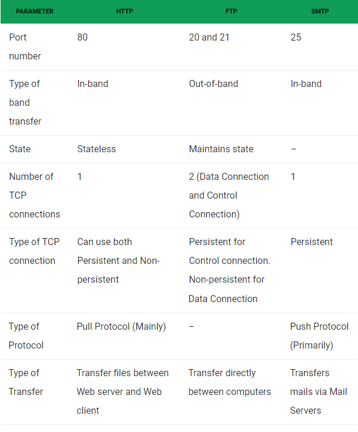

> What are the differences between HTTP, FTP, and SMTP?

* HTTP, FTP, and SMTP
  1. HTTP stands for Hyper Text Transfer Protocol.
  2. FTP for File Transfer Protocol.
  3. SMTP stands for Simple Mail Transfer Protocol.
  4. All the three are used to **transfer information over a computer network**, and are an integral part of today’s internet.

* Why do we need three Protocols for **transferring files**?
  1. We need the three protocols as they all serve different purposes. These are HTTP, FTP, and SMTP.

> HTTP
* HTTP is the backbone of World Wide Web (WWW). It defines the format of messages through which Web Browsers (like Firefox, Chrome) and Web Servers communicate, whilst also defining how a web browser should respond to a particular web browser request.

> FTP
* FTP is the underlying protocol that is used to, as the name suggests, transfer files over a communication network. It establishes two TCP connections, “Control connection” to authenticate the user, and data connection to transfer the files.

> SMTP
* SMTP is what is used by Email servers all over the globe to communicate with each other, so that the assignment you submitted at 11:59 pm reaches your professor’s inbox within the deadline.

> How do their implementations differ?
* All the three are Application Layer Protocols, using TCP as the underlying Transport layer protocol. 
* But the way they use it, and are implemented in general, is vastly different. The below table briefly differentiates between them.

1. HTTP is stateless. A Stateless protocol implies that the HTTP Web Server does not maintains which request had originated from which user. Hence, to give a customized service to the user, HTTP uses Cookies.
2. FTP is Out-of-band, as it uses a separate channel to send data (Data connection), as to send control information (Control connection).
3. As SMTP is much older that HTTP, it restricts all its messages to be in 7-bit ASCII format. Whereas HTTP has no such restriction.
HTTP encapsulates each file in a different HTTP message. Whereas, SMTP places all the contents of a mail in a single message.



* (Ref: https://www.geeksforgeeks.org/what-are-the-differences-between-http-ftp-and-smtp/)

